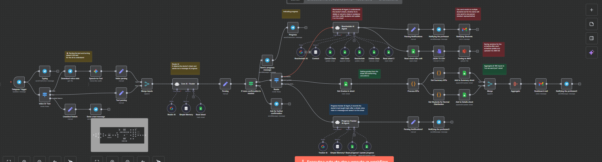
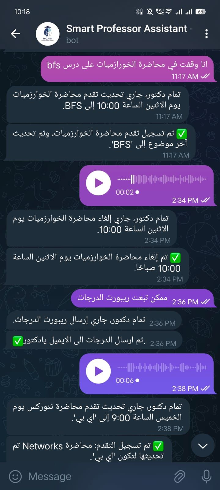
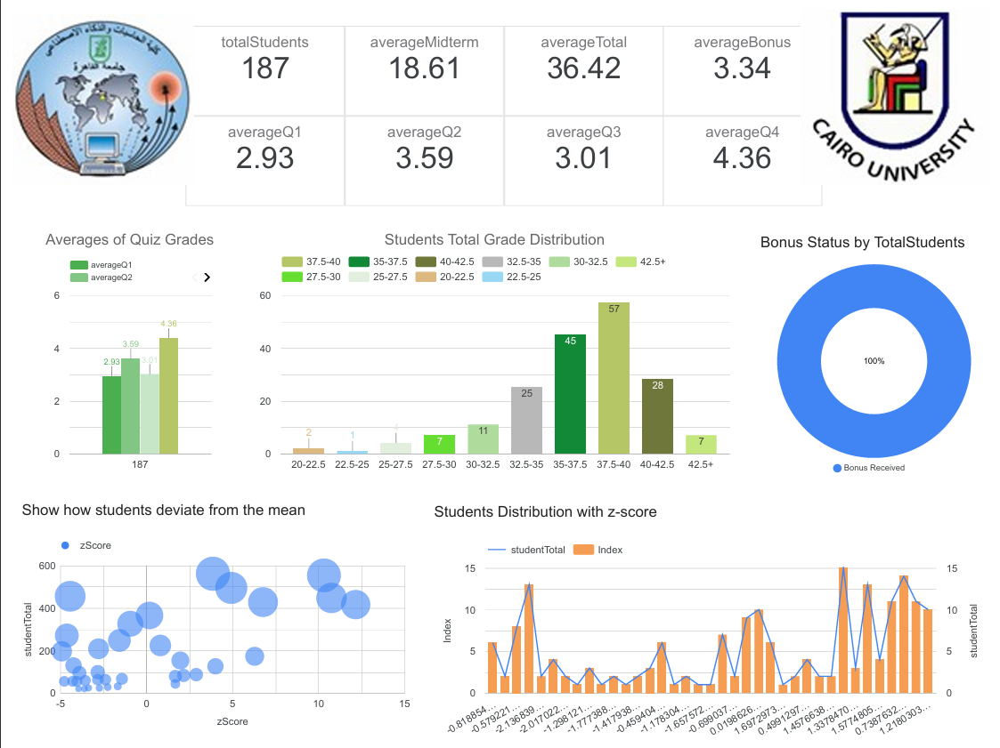

# Moain – Smart Professor Assistant

**First Place Winner** — AI Agent Bootcamp 2025, Faculty of Computing & Artificial Intelligence, Cairo University

---

## Overview

**Moain** is an AI-powered assistant that helps university professors automate daily academic tasks — from rescheduling lectures to sending bilingual notifications, tracking grades and automated student notifications — through natural text or voice commands in **English and Arabic**.

---

## Project Preview

### Workflow Overview

### Bot Demo in Telegram

### Dashboard Preview

### Presentation
[Open the project Presentation](MoainPresentation.pdf) 

---

## The Challenge

Professors spend hours every week managing repetitive academic and administrative tasks such as updating schedules, sending announcements, handling lecture changes, and tracking student progress.  
**Moain** was built to reduce this manual workload through AI-powered intent detection and workflow automation.

---

## Features

- Google Gemini AI intent detection for requests such as rescheduling, cancellation, grades, and progress tracking
- Real-time Google Sheets synchronization
- Automated student notifications in **Arabic and English**
- Grades dashboard for performance tracking and KPI summaries
- Instant confirmations and workflow updates
- Voice and text interaction through **Telegram API**

---

## Technologies Used

| Category | Tools |
|----------|-------|
| AI & NLP | Google Gemini AI |
| Automation | n8n |
| Communication | Telegram API |
| Data | Google Sheets API, Gmail / SMTP |
| Cloud | AWS S3 |

---

## Public Repository Note

This repository includes a **sanitized version** of the workflow export for public sharing.  
Sensitive credentials, private IDs, and deployment-specific values were removed before publishing.

---
## Achievement

**1st Place Winner** at the **AI Agent Bootcamp** organized by the **Faculty of Computing & Artificial Intelligence — Cairo University**.

---

## Team

- **Amin Tariq Amin Abbas**
- **Malak Ahmed Saber**
- **Malak Eltabbakh**
- **Basma Mamdouh**

---

## Mentorship

- **Prof. Haitham S. Hamza**
- **Dr. Dina Ezzat**
- **Eng. Marwan Mohamed Abd El-Monem**
- **Eng. Youssef Elhaddad**

---

## Links

- [LinkedIn Announcement Post](https://www.linkedin.com/posts/amin-t_ai-n8n-automation-activity-7376338520497356800-QlqY?utm_source=share&utm_medium=member_desktop&rcm=ACoAAEXSZrIBNRMEkXpRG-Qqb3noSVNkGEUgfiU)
- [Projects Post](https://www.linkedin.com/posts/marwan513_ai-agents-bootcamp-final-projects-i-activity-7375586872074502146-U1_T?utm_source=share&utm_medium=member_desktop&rcm=ACoAAD5h78MB7e_tD50jWIEIWvzJES-Z2kVw6jc)
- **AI Agent Bootcamp** — Faculty of Computing & Artificial Intelligence, Cairo University
